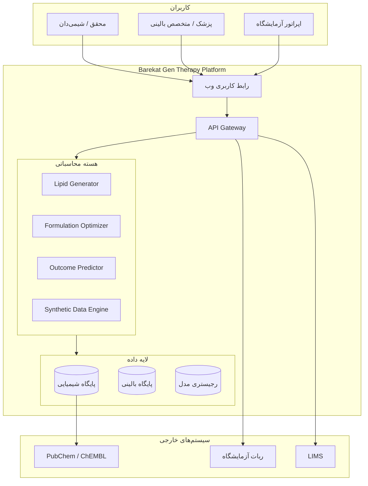
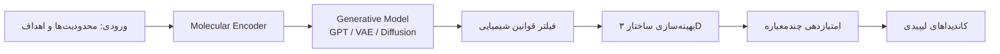
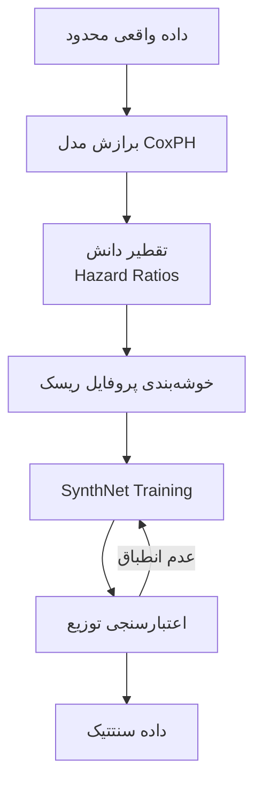
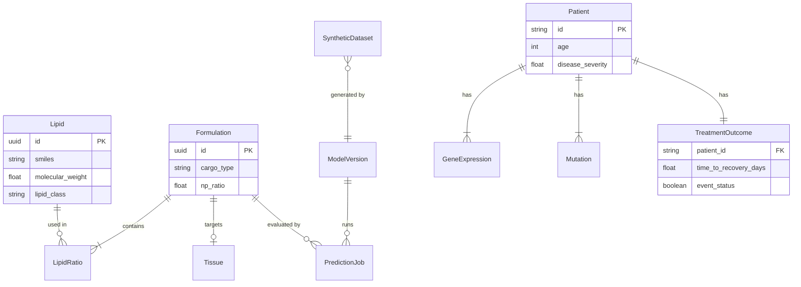
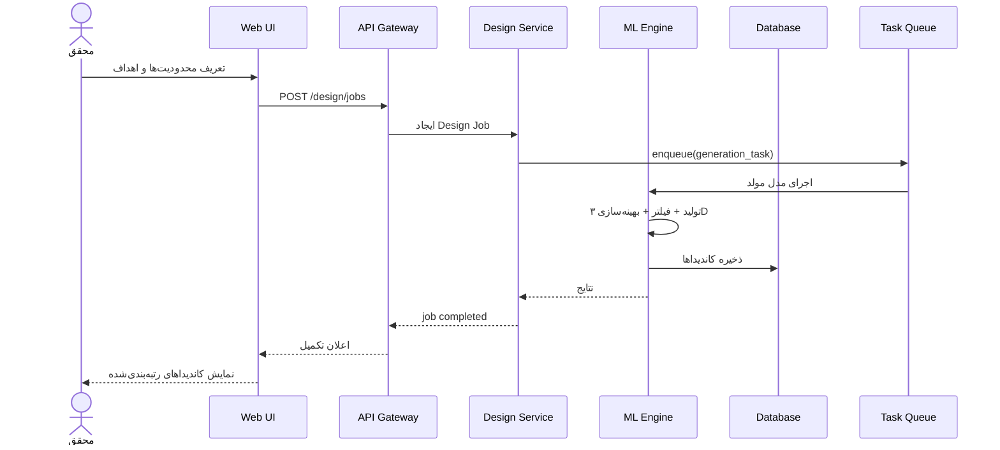
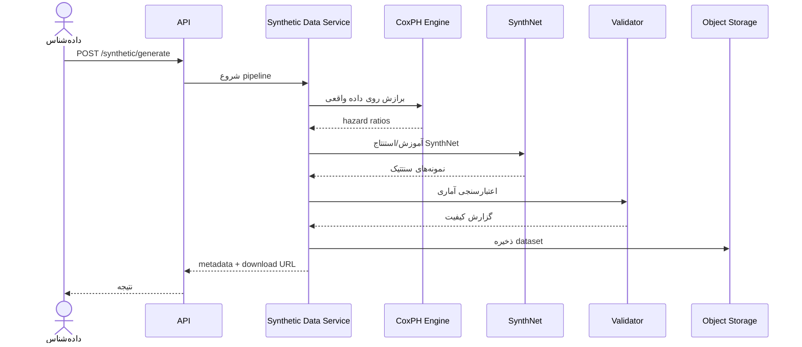
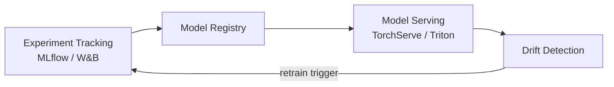
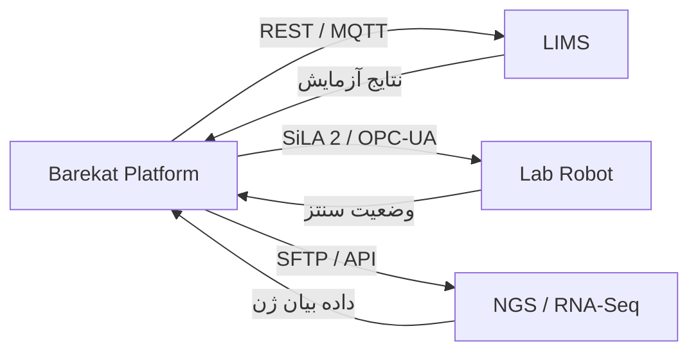
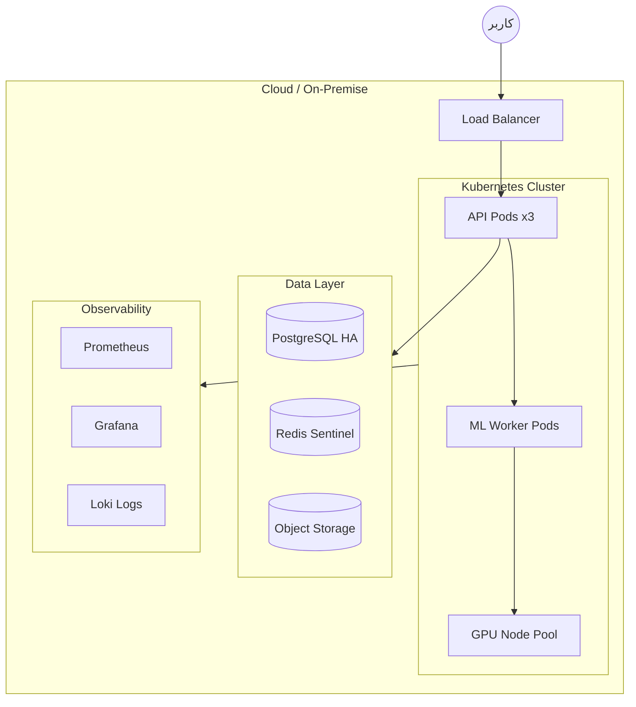

# معماری محصول — Barekat Gen Therapy

> پلتفرم محاسباتی برای طراحی و بهینه‌سازی ناقل‌های ژنی (LNP) با هوش مصنوعی

---

## فهرست مطالب

1. [نمای کلی](#۱-نمای-کلی)
2. [اهداف و محدوده](#۲-اهداف-و-محدوده)
3. [معماری لایه‌ای](#۳-معماری-لایه‌ای)
4. [اجزای اصلی سیستم](#۴-اجزای-اصلی-سیستم)
5. [مدل دامنه](#۵-مدل-دامنه)
6. [جریان داده](#۶-جریان-داده)
7. [خط لوله یادگیری ماشین](#۷-خط-لوله-یادگیری-ماشین)
8. [طراحی API](#۸-طراحی-api)
9. [پایگاه داده و ذخیره‌سازی](#۹-پایگاه-داده-و-ذخیره‌سازی)
10. [یکپارچه‌سازی آزمایشگاه](#۱۰-یکپارچه‌سازی-آزمایشگاه)
11. [امنیت و انطباق](#۱۱-امنیت-و-انطباق)
12. [زیرساخت و استقرار](#۱۲-زیرساخت-و-استقرار)
13. [ساختار پوشه‌های پیشنهادی](#۱۳-ساختار-پوشه‌های-پیشنهادی)
14. [نقشه راه پیاده‌سازی](#۱۴-نقشه-راه-پیاده‌سازی)

---

## ۱. نمای کلی

Barekat Gen Therapy یک پلتفرم **AI-native** است که چرخه کامل «طراحی → پیش‌بینی → رتبه‌بندی → سنتز → اعتبارسنجی» ناقل‌های ژنی را پوشش می‌دهد. محصول بر دو محور اصلی استوار است:

| محور | توضیح |
|------|-------|
| **طراحی ناقل (Carrier Design)** | تولید و بهینه‌سازی ساختار شیمیایی لیپیدها و فرمولاسیون LNP با مدل‌های مولد |
| **پیش‌بینی بالینی (Clinical Outcome)** | مدل‌سازی پاسخ درمانی، سمیت و ایمنی با رویکرد CK4Gen/CoxPH و داده‌های سنتتیک |



---

## ۲. اهداف و محدوده

### اهداف محصول

- طراحی کتابخانه‌های وسیع از لیپیدهای نو با ساختار سه‌بعدی بهینه
- پیش‌بینی کارایی انتقال ژن در بافت‌های مختلف (طحال، سلول‌های سرطانی و ...)
- رتبه‌بندی کاندیداها برای سنتز و آزمایش
- پیشنهاد مسیرهای سنتز شیمیایی
- تولید داده‌های سنتتیک با کیفیت بالا در شرایط کمبود داده واقعی

### ورودی‌ها

| نوع | مثال |
|-----|------|
| ساختار شیمیایی | SMILES، InChI، مختصات ۳D |
| فرمولاسیون | نسبت لیپیدها، pH، غلظت RNA |
| داده تجربی | کارایی برون‌تنی/درون‌تنی، سمیت |
| زمینه بالینی | سن، جنسیت، نوع بیماری، وضعیت ایمنی |
| بافت هدف | نوع سلول، بافت، اندیکاسیون |

### خروجی‌ها

| نوع | مثال |
|-----|------|
| کاندیداهای لیپیدی | لیست رتبه‌بندی‌شده با امتیاز اطمینان |
| پیش‌بینی کارایی | احتمال انتقال ژن موفق در هر بافت |
| مسیر سنتز | گام‌های شیمیایی پیشنهادی |
| گزارش ایمنی | سطح سمیت، ریسک طوفان سایتوکاین |
| داده سنتتیک | مجموعه داده برای آموزش مدل‌های بعدی |

### محدودیت‌های کلیدی

- کمیابی داده‌های واقعی ژن‌درمانی
- نیاز به پیش‌بینی دقیق سمیت و پاسخ ایمنی
- یکپارچه‌سازی با اتوماسیون آزمایشگاهی
- انطباق با مقررات حفاظت از داده‌های بیمار (HIPAA/GDPR)

---

## ۳. معماری لایه‌ای

```mermaid
graph LR
    subgraph L1["لایه ۱ — ارائه"]
        Web[Web App]
        CLI[CLI Tools]
        SDK[Python SDK]
    end

    subgraph L2["لایه ۲ — API"]
        Gateway[API Gateway]
        Auth[Authentication]
        RateLimit[Rate Limiting]
    end

    subgraph L3["لایه ۳ — سرویس‌های دامنه"]
        DesignSvc[Carrier Design Service]
        PredictSvc[Prediction Service]
        SynthSvc[Synthetic Data Service]
        RankSvc[Ranking Service]
        SynthRouteSvc[Synthesis Route Service]
    end

    subgraph L4["لایه ۴ — ML Engine"]
        GenModel[Generative Models]
        CoxModel[CoxPH / Survival Models]
        SynthNet[SynthNet]
        ToxicityModel[Toxicity Predictor]
        EmbedModel[Molecular Embeddings]
    end

    subgraph L5["لایه ۵ — داده"]
        PostgreSQL[(PostgreSQL)]
        MinIO[(Object Storage)]
        Redis[(Redis Cache)]
        VectorDB[(Vector DB)]
    end

    subgraph L6["لایه ۶ — زیرساخت"]
        K8s[Kubernetes]
        GPU[GPU Workers]
        Queue[Task Queue]
        Monitor[Observability]
    end

    L1 --> L2 --> L3 --> L4 --> L5
    L4 --> L6
    L3 --> L6
```



### اصول معماری

| اصل | توضیح |
|-----|-------|
| **Modular Monolith → Microservices** | شروع با monolith ماژولار؛ جداسازی سرویس‌ها در فاز رشد |
| **ML as a Service** | مدل‌ها به‌صورت سرویس مستقل با نسخه‌بندی |
| **Event-Driven Jobs** | وظایف سنگین ML از طریق صف ناهمزمان |
| **Data Lineage** | ردیابی کامل منشأ هر پیش‌بینی و داده سنتتیک |
| **Reproducibility** | هر آزمایش ML با seed، نسخه مدل و پارامترها قابل تکرار |

---

## ۴. اجزای اصلی سیستم

### ۴.۱ Carrier Design Engine (موتور طراحی ناقل)

مسئول تولید و بهینه‌سازی ساختارهای لیپیدی.



**مسئولیت‌ها:**
- تولید SMILES/InChI جدید در فضای شیمیایی معتبر
- بهینه‌سازی ساختار سه‌بعدی (RDKit, Open Babel)
- اعمال قیود فیزیکوشیمیایی (logP، وزن مولکولی، قطبش)
- یکپارچه‌سازی با پایگاه‌های مرجع (PubChem, ChEMBL)

### ۴.۲ Formulation Optimizer (بهینه‌ساز فرمولاسیون)

| پارامتر | محدوده | هدف |
|---------|--------|-----|
| نسبت لیپید کمکی به یونی | ۱۰–۵۰٪ | پایداری LNP |
| نسبت PEG | ۰.۵–۵٪ | نیمه‌عمر پلاسمایی |
| N/P ratio | ۲–۸ | کارایی بسته‌بندی RNA |
| غلظت RNA | ۰.۱–۲ mg/mL | دوز درمانی |

### ۴.۳ Outcome Predictor (پیش‌بینی‌کننده پیامد)

مدل‌های پیش‌بینی پاسخ درمانی، سمیت و رویدادهای بالینی.

- **Cox Proportional Hazards (CoxPH):** برازش روی داده واقعی محدود
- **Deep Survival Models:** DeepSurv, DeepHit برای پیش‌بینی زمان تا رویداد
- **Toxicity Classifier:** پیش‌بینی سطح سمیت و طوفان سایتوکاین

### ۴.۴ Synthetic Data Engine (موتور داده سنتتیک)

پیاده‌سازی چارچوب CK4Gen برای تولید داده در شرایط کمبود نمونه واقعی.



**ویژگی‌های کلیدی:**
- حفظ توزیع زمان تا رویداد (Survival Time)
- حفظ روابط بین متغیرهای بالینی
- خوشه‌بندی برای جلوگیری از «محو شدن» پروفایل‌های ریسک
- اعتبارسنجی آماری (KS-test, C-index)

### ۴.۵ Ranking & Recommendation Service

ترکیب امتیازات چندمعیاره برای رتبه‌بندی نهایی:

```
Final Score = w₁·Efficacy + w₂·Safety + w₃·Synthesizability + w₄·Cost
```

### ۴.۶ Synthesis Route Planner

- پیشنهاد مسیر سنتز بر اساس گروه‌های عملکردی
- برآورد هزینه و زمان سنتز
- یکپارچه‌سازی با پایگاه‌های واکنش (Reaxys, SciFinder)

---

## ۵. مدل دامنه

### ۵.۱ موجودیت‌های شیمیایی

```
Lipid
├── id: UUID
├── name: string
├── smiles: string
├── inchi: string
├── molecular_weight: float
├── logP: float
├── structure_3d: bytes (SDF/MOL2)
├── lipid_class: enum (ionizable, helper, sterol, PEG)
└── created_at: timestamp

Formulation
├── id: UUID
├── lipids: LipidRatio[]
├── cargo_type: enum (mRNA, siRNA, DNA, CRISPR)
├── cargo_sequence: string
├── np_ratio: float
├── target_tissue: Tissue
└── ph: float

LipidRatio
├── lipid_id: UUID
├── molar_ratio: float
```

### ۵.۲ موجودیت‌های بالینی

```
Patient (ناشناس‌سازی‌شده)
├── id: string (GT_XXXX)
├── age: int
├── gender: enum
├── disease_severity: float (1-10)
├── immune_status: enum
└── disease_type: string

GeneExpression
├── patient_id: string
├── gene_id: string
├── expression_level: float (log2)

Mutation
├── patient_id: string
├── gene_id: string
├── is_mutated: boolean

TreatmentOutcome
├── patient_id: string
├── time_to_recovery_days: float
├── event_status: boolean
├── treatment_response: boolean
├── toxicity_level: float (0-4)
└── cytokine_storm: boolean
```

### ۵.۳ موجودیت‌های ML

```
ModelVersion
├── id: UUID
├── name: string
├── version: semver
├── type: enum (generative, survival, toxicity, embedding)
├── metrics: JSON
├── artifact_path: string
└── trained_at: timestamp

PredictionJob
├── id: UUID
├── model_version_id: UUID
├── input_payload: JSON
├── status: enum (queued, running, completed, failed)
├── result: JSON
└── created_at: timestamp

SyntheticDataset
├── id: UUID
├── source_model: string
├── n_samples: int
├── validation_metrics: JSON
├── storage_path: string
└── generated_at: timestamp
```

### ۵.۴ نمودار روابط (ER)



---

## ۶. جریان داده

### ۶.۱ جریان طراحی ناقل (Carrier Design Flow)



### ۶.۲ جریان تولید داده سنتتیک



---

## ۷. خط لوله یادگیری ماشین

### ۷.۱ پipeline آموزش

```
┌─────────────┐    ┌──────────────┐    ┌─────────────┐    ┌──────────────┐
│  Data Prep  │───▶│  Training    │───▶│ Evaluation  │───▶│  Registry    │
│  & Augment  │    │  (GPU)       │    │  & Validate │    │  & Deploy    │
└─────────────┘    └──────────────┘    └─────────────┘    └──────────────┘
```

### ۷.۲ مدل‌های پیشنهادی

| مدل | کاربرد | فریم‌ورک |
|-----|--------|----------|
| **MolGPT / ChemGPT** | تولید ساختار لیپیدی | PyTorch |
| **Graph Neural Network** | پیش‌بینی خواص مولکولی | PyTorch Geometric |
| **CoxPH** | مدل‌سازی بقا | lifelines / scikit-survival |
| **SynthNet** | تولید داده سنتتیک | PyTorch |
| **DeepSurv** | پیش‌بینی عمیق بقا | PyTorch |
| **Molecular Transformer** | embedding ساختار شیمیایی | HuggingFace |

### ۷.۳ متریک‌های ارزیابی

| حوزه | متریک |
|------|-------|
| تولید مولکولی | Validity, Uniqueness, Novelty, FCD |
| بقا | C-index, Integrated Brier Score |
| سمیت | AUC-ROC, Sensitivity @ fixed specificity |
| داده سنتتیک | KS-statistic, MMD, Correlation preservation |

### ۷.۴ MLOps



---

## ۸. طراحی API

### ۸.۱ اصول

- RESTful API با نسخه‌بندی (`/api/v1/`)
- احراز هویت JWT + API Key
- پاسخ‌های ناهمزمان برای وظایف ML (Job-based)
- OpenAPI 3.0 specification

### ۸.۲ Endpoints اصلی

#### طراحی ناقل

| Method | Endpoint | توضیح |
|--------|----------|-------|
| `POST` | `/api/v1/design/jobs` | ایجاد job طراحی لیپید |
| `GET` | `/api/v1/design/jobs/{id}` | وضعیت و نتایج job |
| `GET` | `/api/v1/design/jobs/{id}/candidates` | لیست کاندیداها |
| `POST` | `/api/v1/design/jobs/{id}/rank` | رتبه‌بندی مجدد |

#### پیش‌بینی

| Method | Endpoint | توضیح |
|--------|----------|-------|
| `POST` | `/api/v1/predict/efficacy` | پیش‌بینی کارایی انتقال ژن |
| `POST` | `/api/v1/predict/toxicity` | پیش‌بینی سمیت |
| `POST` | `/api/v1/predict/outcome` | پیش‌بینی پیامد بالینی |

#### داده سنتتیک

| Method | Endpoint | توضیح |
|--------|----------|-------|
| `POST` | `/api/v1/synthetic/generate` | تولید dataset سنتتیک |
| `GET` | `/api/v1/synthetic/datasets` | لیست datasetها |
| `GET` | `/api/v1/synthetic/datasets/{id}` | دانلود dataset |

#### مدیریت

| Method | Endpoint | توضیح |
|--------|----------|-------|
| `GET` | `/api/v1/lipids` | جستجوی لیپید |
| `POST` | `/api/v1/lipids` | ثبت لیپید جدید |
| `GET` | `/api/v1/models` | لیست مدل‌های موجود |
| `GET` | `/api/v1/health` | وضعیت سلامت سیستم |

### ۸.۳ نمونه Request/Response

```json
// POST /api/v1/design/jobs
{
  "target_tissue": "spleen",
  "cargo_type": "mRNA",
  "constraints": {
    "max_molecular_weight": 800,
    "min_logP": 2.0,
    "max_logP": 8.0,
    "lipid_class": "ionizable"
  },
  "n_candidates": 100,
  "optimization_objectives": ["efficacy", "safety", "synthesizability"]
}

// Response
{
  "job_id": "550e8400-e29b-41d4-a716-446655440000",
  "status": "queued",
  "estimated_duration_seconds": 120,
  "created_at": "2026-07-13T10:30:00Z"
}
```

---

## ۹. پایگاه داده و ذخیره‌سازی

### ۹.۱ پایگاه‌های داده

| ذخیره‌ساز | کاربرد | فناوری |
|-----------|--------|--------|
| **Primary DB** | موجودیت‌ها، متادیتا، کاربران | PostgreSQL 16 |
| **Object Storage** | مدل‌ها، datasetها، ساختار ۳D | MinIO / S3 |
| **Cache** | نتایج پیش‌بینی، session | Redis 7 |
| **Vector DB** | جستجوی شباهت مولکولی | Qdrant / Milvus |
| **Search** | جستجوی متنی و فیلتر | Elasticsearch |

### ۹.۲ استراتژی داده

- **داده واقعی:** رمزنگاری at-rest و in-transit؛ ناشناس‌سازی PII
- **داده سنتتیک:** برچسب‌گذاری صریح `synthetic=true`؛ جداسازی از داده واقعی
- **Lineage:** هر رکورد دارای `source`, `model_version`, `generated_at`

---

## ۱۰. یکپارچه‌سازی آزمایشگاه



### پروتکل‌های پشتیبانی

| سیستم | پروتکل | داده |
|-------|--------|------|
| LIMS | REST API, HL7 FHIR | نتایج آزمایش، نمونه‌ها |
| ربات سنتز | SiLA 2, MQTT | دستورات سنتز، وضعیت |
| توالی‌یابی | SFTP, API | فایل‌های FASTQ, counts |
| پایگاه‌های مرجع | REST | PubChem, ChEMBL, DrugBank |

---

## ۱۱. امنیت و انطباق

### ۱۱.۱ احراز هویت و مجوز

| لایه | مکانیزم |
|------|---------|
| احراز هویت | OAuth 2.0 / OIDC, JWT |
| مجوز | RBAC (Admin, Scientist, Clinician, Viewer) |
| API | API Key + Rate Limiting |
| داده | Row-Level Security در PostgreSQL |

### ۱۱.۲ انطباق

| استاندارد | اقدام |
|-----------|-------|
| **HIPAA** | ناشناس‌سازی PHI، audit log |
| **GDPR** | حق حذف، consent management |
| **GMP** | traceability در خط تولید آزمایشگاهی |
| **21 CFR Part 11** | امضای الکترونیک، audit trail |

### ۱۱.۳ امنیت ML

- جداسازی محیط inference از training
- اعتبارسنجی ورودی (جلوگیری از adversarial input)
- مانیتورینگ model drift و data poisoning

---

## ۱۲. زیرساخت و استقرار

### ۱۲.۱ معماری استقرار



### ۱۲.۲ استک فناوری پیشنهادی

| لایه | فناوری |
|------|--------|
| **Frontend** | React 19, TypeScript, Tailwind CSS, TanStack Query |
| **Backend API** | FastAPI (Python 3.12) |
| **Task Queue** | Celery + Redis |
| **ML** | PyTorch 2.x, RDKit, lifelines, scikit-survival |
| **Database** | PostgreSQL 16, SQLAlchemy 2.0, Alembic |
| **Container** | Docker, Kubernetes (K8s) |
| **CI/CD** | GitHub Actions |
| **Monitoring** | Prometheus, Grafana, Sentry |

### ۱۲.۳ نیازمندی‌های سخت‌افزاری

| محیط | CPU | RAM | GPU |
|------|-----|-----|-----|
| Development | 4 core | 16 GB | — |
| Staging | 8 core | 32 GB | 1× T4 |
| Production (API) | 16 core | 64 GB | — |
| Production (ML) | 32 core | 128 GB | 2× A100 |

---

## ۱۳. ساختار پوشه‌های پیشنهادی

```
barekat-gen-therapy/
├── README.md
├── docs/
│   ├── ARCHITECTURE.md          # این سند
│   ├── API.md                   # مستندات API
│   └── DEPLOYMENT.md            # راهنمای استقرار
│
├── backend/
│   ├── app/
│   │   ├── main.py              # FastAPI entry point
│   │   ├── api/
│   │   │   ├── v1/
│   │   │   │   ├── design.py
│   │   │   │   ├── predict.py
│   │   │   │   └── synthetic.py
│   │   │   └── deps.py
│   │   ├── core/
│   │   │   ├── config.py
│   │   │   ├── security.py
│   │   │   └── database.py
│   │   ├── models/              # SQLAlchemy models
│   │   ├── schemas/             # Pydantic schemas
│   │   └── services/            # Business logic
│   ├── ml/
│   │   ├── generative/          # Lipid generation models
│   │   ├── survival/            # CoxPH, DeepSurv
│   │   ├── synthetic/           # SynthNet, CK4Gen
│   │   ├── toxicity/            # Toxicity predictors
│   │   └── evaluation/          # Metrics & validation
│   ├── workers/                 # Celery tasks
│   ├── tests/
│   ├── alembic/                 # DB migrations
│   ├── pyproject.toml
│   └── Dockerfile
│
├── frontend/
│   ├── src/
│   │   ├── components/
│   │   ├── pages/
│   │   ├── hooks/
│   │   └── api/
│   ├── package.json
│   └── Dockerfile
│
├── data/
│   ├── generators/
│   │   └── synthetic_clinical.py  # (انتقال از data فعلی)
│   ├── seeds/                     # داده اولیه
│   └── schemas/                   # JSON Schema
│
├── infra/
│   ├── docker-compose.yml
│   ├── kubernetes/
│   └── terraform/
│
└── scripts/
    ├── seed_db.py
    └── train_models.py
```

---

## ۱۴. نقشه راه پیاده‌سازی

### فاز ۱ — پایه (هفته ۱–۴)

| هدف | خروجی |
|-----|-------|
| ساختار پروژه و CI/CD | Repo scaffold, Docker, GitHub Actions |
| API پایه | FastAPI + PostgreSQL + Auth |
| Generator داده سنتتیک | انتقال و بهبود اسکریپت `data` |
| مدل CoxPH | برازش و ارزیابی روی داده سنتتیک |

### فاز ۲ — هسته ML (هفته ۵–۱۰)

| هدف | خروجی |
|-----|-------|
| SynthNet | تولید داده سنتتیک با چارچوب CK4Gen |
| Molecular Encoder | embedding ساختارهای شیمیایی |
| API پیش‌بینی | endpoints efficacy/toxicity/outcome |
| Dashboard اولیه | UI برای مشاهده نتایج |

### فاز ۳ — طراحی ناقل (هفته ۱۱–۱۶)

| هدف | خروجی |
|-----|-------|
| مدل مولد لیپید | تولید SMILES معتبر |
| بهینه‌ساز فرمولاسیون | LNP formulation optimizer |
| رتبه‌بندی چندمعیاره | Ranking service |
| ساختار ۳D | RDKit conformer generation |

### فاز ۴ — یکپارچه‌سازی (هفته ۱۷–۲۰)

| هدف | خروجی |
|-----|-------|
| LIMS connector | دریافت نتایج آزمایش |
| Lab robot API | ارسال دستورات سنتز |
| MLOps pipeline | MLflow, model registry, A/B testing |
| گزارش‌دهی | PDF/Excel export |

### فاز ۵ — تولید (هفته ۲۱+)

| هدف | خروجی |
|-----|-------|
| امنیت و انطباق | Audit log, encryption, RBAC |
| Performance tuning | GPU optimization, caching |
| مستندات کاربر | User guide, API docs |
| استقرار production | K8s, monitoring, alerting |

---

## پیوست: وضعیت فعلی پروژه

| بخش | وضعیت |
|-----|-------|
| README (چشم‌انداز محصول) | ✅ موجود |
| Generator داده سنتتیک (پروتوتایپ) | ✅ موجود (`data`) |
| معماری محصول | ✅ این سند |
| زیرساخت (Docker, CI/CD, K8s) | ✅ فاز ۱ |
| Backend API | 🟡 اسکلت اولیه |
| Frontend | 🟡 اسکلت اولیه |
| مدل‌های ML | ⬜ فاز ۲–۳ |
| یکپارچه‌سازی آزمایشگاه | ⬜ فاز ۴ |

---

*آخرین به‌روزرسانی: ۱۴۰۵/۰۴/۲۲ (۲۰۲۶-۰۷-۱۳)*
