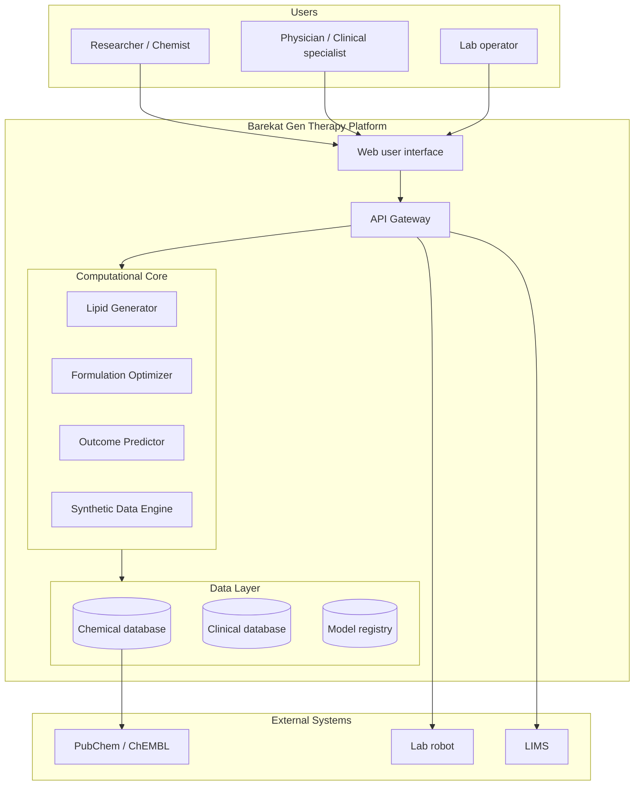
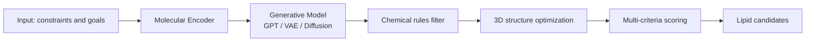
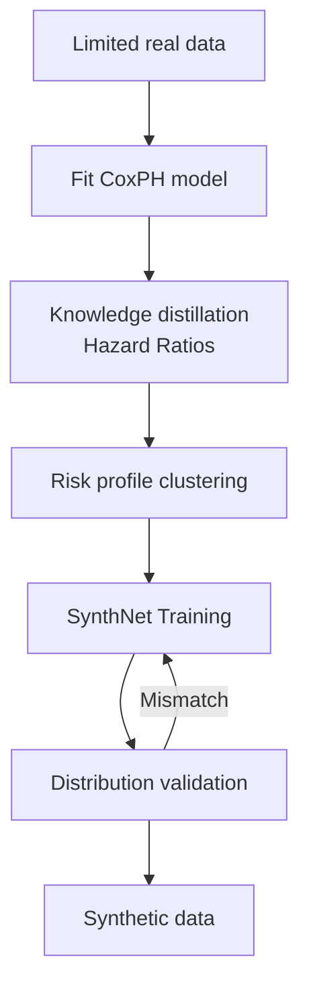
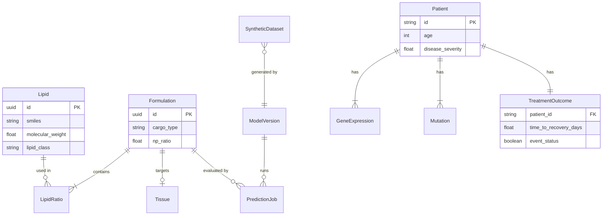
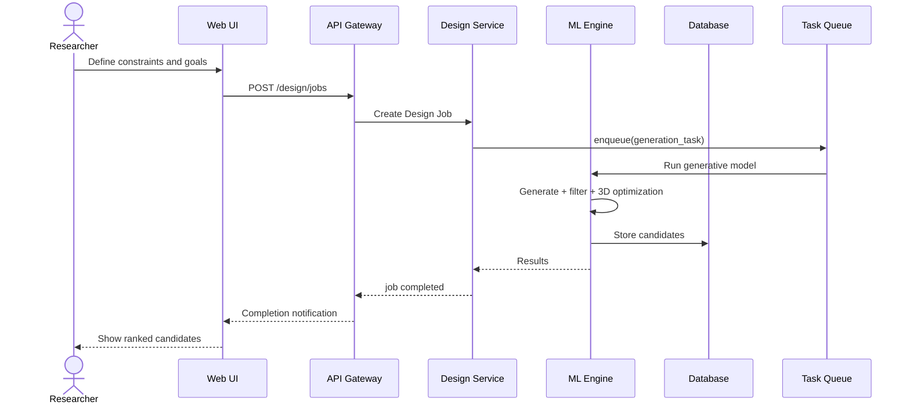
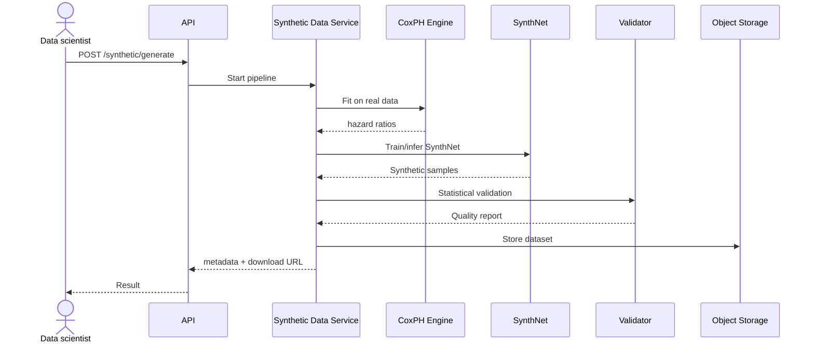
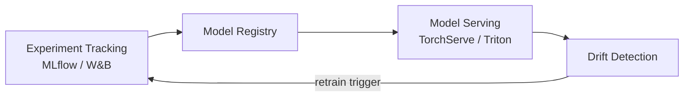
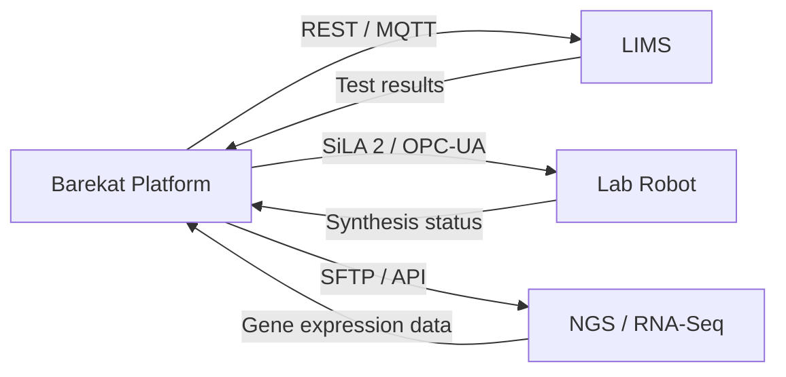
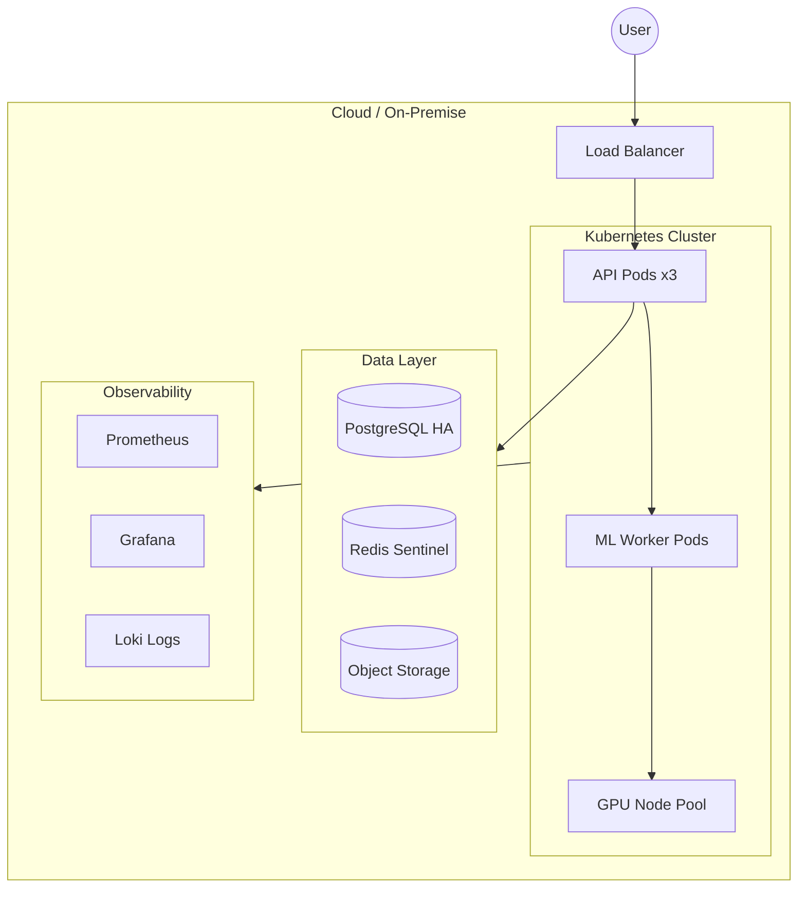

# Product Architecture — Barekat Gen Therapy

> A computational platform for AI-based design and optimization of gene vectors (LNP)

---

## Table of Contents

1. [Overview](#1-overview)
2. [Goals and Scope](#2-goals-and-scope)
3. [Layered Architecture](#3-layered-architecture)
4. [Main System Components](#4-main-system-components)
5. [Domain Model](#5-domain-model)
6. [Data Flow](#6-data-flow)
7. [Machine Learning Pipeline](#7-machine-learning-pipeline)
8. [API Design](#8-api-design)
9. [Database and Storage](#9-database-and-storage)
10. [Laboratory Integration](#10-laboratory-integration)
11. [Security and Compliance](#11-security-and-compliance)
12. [Infrastructure and Deployment](#12-infrastructure-and-deployment)
13. [Proposed Folder Structure](#13-proposed-folder-structure)
14. [Implementation Roadmap](#14-implementation-roadmap)

---

## 1. Overview

Barekat Gen Therapy is an **AI-native** platform that covers the full "design → prediction → ranking → synthesis → validation" cycle of gene vectors. The product rests on two main axes:

| Axis | Description |
|------|-------|
| **Carrier Design** | Generating and optimizing the chemical structure of lipids and LNP formulations with generative models |
| **Clinical Outcome** | Modeling therapeutic response, toxicity and safety with the CK4Gen/CoxPH approach and synthetic data |


```mermaid
graph TB
    subgraph Users["Users"]
        Scientist[Researcher / Chemist]
        Clinician[Physician / Clinical specialist]
        LabTech[Lab operator]
    end

    subgraph Platform["Barekat Gen Therapy Platform"]
        UI[Web user interface]
        API[API Gateway]
        
        subgraph Core["Computational Core"]
            LipidGen[Lipid Generator]
            FormOpt[Formulation Optimizer]
            OutcomePred[Outcome Predictor]
            SynthData[Synthetic Data Engine]
        end
        
        subgraph Data["Data Layer"]
            ChemDB[(Chemical database)]
            ClinDB[(Clinical database)]
            ModelRegistry[(Model registry)]
        end
    end

    subgraph External["External Systems"]
        PubChem[PubChem / ChEMBL]
        LabRobot[Lab robot]
        LIMS[LIMS]
    end

    Scientist --> UI
    Clinician --> UI
    LabTech --> UI
    UI --> API
    API --> Core
    Core --> Data
    ChemDB --> PubChem
    API --> LabRobot
    API --> LIMS
```

---

## 2. Goals and Scope

### Product Goals

- Design extensive libraries of novel lipids with optimal 3D structure
- Predict gene delivery efficiency in different tissues (spleen, cancer cells, etc.)
- Rank candidates for synthesis and testing
- Suggest chemical synthesis routes
- Generate high-quality synthetic data when real data is scarce

### Inputs

| Type | Example |
|-----|------|
| Chemical structure | SMILES, InChI, 3D coordinates |
| Formulation | Lipid ratios, pH, RNA concentration |
| Experimental data | In-vitro/in-vivo efficiency, toxicity |
| Clinical context | Age, sex, disease type, immune status |
| Target tissue | Cell type, tissue, indication |

### Outputs

| Type | Example |
|-----|------|
| Lipid candidates | Ranked list with confidence score |
| Efficacy prediction | Probability of successful gene delivery in each tissue |
| Synthesis route | Suggested chemical steps |
| Safety report | Toxicity level, cytokine storm risk |
| Synthetic data | Dataset for training subsequent models |

### Key Constraints

- Scarcity of real gene therapy data
- Need for accurate toxicity and immune response prediction
- Integration with laboratory automation
- Compliance with patient data protection regulations (HIPAA/GDPR)

---

## 3. Layered Architecture


```mermaid
graph LR
    subgraph L1["Layer 1 — Presentation"]
        Web[Web App]
        CLI[CLI Tools]
        SDK[Python SDK]
    end

    subgraph L2["Layer 2 — API"]
        Gateway[API Gateway]
        Auth[Authentication]
        RateLimit[Rate Limiting]
    end

    subgraph L3["Layer 3 — Domain Services"]
        DesignSvc[Carrier Design Service]
        PredictSvc[Prediction Service]
        SynthSvc[Synthetic Data Service]
        RankSvc[Ranking Service]
        SynthRouteSvc[Synthesis Route Service]
    end

    subgraph L4["Layer 4 — ML Engine"]
        GenModel[Generative Models]
        CoxModel[CoxPH / Survival Models]
        SynthNet[SynthNet]
        ToxicityModel[Toxicity Predictor]
        EmbedModel[Molecular Embeddings]
    end

    subgraph L5["Layer 5 — Data"]
        PostgreSQL[(PostgreSQL)]
        MinIO[(Object Storage)]
        Redis[(Redis Cache)]
        VectorDB[(Vector DB)]
    end

    subgraph L6["Layer 6 — Infrastructure"]
        K8s[Kubernetes]
        GPU[GPU Workers]
        Queue[Task Queue]
        Monitor[Observability]
    end

    L1 --> L2 --> L3 --> L4 --> L5
    L4 --> L6
    L3 --> L6
```

### Architectural Principles

| Principle | Description |
|-----|-------|
| **Modular Monolith → Microservices** | Start with a modular monolith; split services in the growth phase |
| **ML as a Service** | Models as independent, versioned services |
| **Event-Driven Jobs** | Heavy ML tasks via an asynchronous queue |
| **Data Lineage** | Complete tracing of the origin of each prediction and synthetic data |
| **Reproducibility** | Every ML experiment is repeatable by seed, model version and parameters |

---

## 4. Main System Components

### 4.1 Carrier Design Engine

Responsible for generating and optimizing lipid structures.


```mermaid
flowchart LR
    Input[Input: constraints and goals] --> Encoder[Molecular Encoder]
    Encoder --> Generator[Generative Model<br/>GPT / VAE / Diffusion]
    Generator --> Filter[Chemical rules filter]
    Filter --> Dock3D[3D structure optimization]
    Dock3D --> Score[Multi-criteria scoring]
    Score --> Output[Lipid candidates]
```

**Responsibilities:**
- Generating new SMILES/InChI in a valid chemical space
- 3D structure optimization (RDKit, Open Babel)
- Applying physicochemical constraints (logP, molecular weight, polarity)
- Integration with reference databases (PubChem, ChEMBL)

### 4.2 Formulation Optimizer

| Parameter | Range | Goal |
|---------|--------|-----|
| Helper-to-ionizable lipid ratio | 10–50% | LNP stability |
| PEG ratio | 0.5–5% | Plasma half-life |
| N/P ratio | 2–8 | RNA packaging efficiency |
| RNA concentration | 0.1–2 mg/mL | Therapeutic dose |

### 4.3 Outcome Predictor

Models for predicting therapeutic response, toxicity and clinical events.

- **Cox Proportional Hazards (CoxPH):** fitting on limited real data
- **Deep Survival Models:** DeepSurv, DeepHit for time-to-event prediction
- **Toxicity Classifier:** predicting toxicity level and cytokine storm

### 4.4 Synthetic Data Engine

Implementation of the CK4Gen framework for generating data when real samples are scarce.


```mermaid
flowchart TD
    RealData[Limited real data] --> CoxFit[Fit CoxPH model]
    CoxFit --> Distill[Knowledge distillation<br/>Hazard Ratios]
    Distill --> Cluster[Risk profile clustering]
    Cluster --> SynthNet[SynthNet Training]
    SynthNet --> Validate[Distribution validation]
    Validate --> Synthetic[Synthetic data]
    Validate -->|Mismatch| SynthNet
```

**Key features:**
- Preserving the distribution of time to event (Survival Time)
- Preserving relationships between clinical variables
- Clustering to prevent "fading" of risk profiles
- Statistical validation (KS-test, C-index)

### 4.5 Ranking & Recommendation Service

Combining multi-criteria scores for the final ranking:

```
Final Score = w₁·Efficacy + w₂·Safety + w₃·Synthesizability + w₄·Cost
```

### 4.6 Synthesis Route Planner

- Suggesting a synthesis route based on functional groups
- Estimating synthesis cost and time
- Integration with reaction databases (Reaxys, SciFinder)

---

## 5. Domain Model

### 5.1 Chemical Entities

```
Lipid
├── id: UUID
├── name: string
├── smiles: string
├── inchi: string
├── molecular_weight: float
├── logP: float
├── structure_3d: bytes (SDF/MOL2)
├── lipid_class: enum (ionizable, helper, sterol, PEG)
└── created_at: timestamp

Formulation
├── id: UUID
├── lipids: LipidRatio[]
├── cargo_type: enum (mRNA, siRNA, DNA, CRISPR)
├── cargo_sequence: string
├── np_ratio: float
├── target_tissue: Tissue
└── ph: float

LipidRatio
├── lipid_id: UUID
├── molar_ratio: float
```

### 5.2 Clinical Entities

```
Patient (anonymized)
├── id: string (GT_XXXX)
├── age: int
├── gender: enum
├── disease_severity: float (1-10)
├── immune_status: enum
└── disease_type: string

GeneExpression
├── patient_id: string
├── gene_id: string
├── expression_level: float (log2)

Mutation
├── patient_id: string
├── gene_id: string
├── is_mutated: boolean

TreatmentOutcome
├── patient_id: string
├── time_to_recovery_days: float
├── event_status: boolean
├── treatment_response: boolean
├── toxicity_level: float (0-4)
└── cytokine_storm: boolean
```

### 5.3 ML Entities

```
ModelVersion
├── id: UUID
├── name: string
├── version: semver
├── type: enum (generative, survival, toxicity, embedding)
├── metrics: JSON
├── artifact_path: string
└── trained_at: timestamp

PredictionJob
├── id: UUID
├── model_version_id: UUID
├── input_payload: JSON
├── status: enum (queued, running, completed, failed)
├── result: JSON
└── created_at: timestamp

SyntheticDataset
├── id: UUID
├── source_model: string
├── n_samples: int
├── validation_metrics: JSON
├── storage_path: string
└── generated_at: timestamp
```

### 5.4 Relationship Diagram (ER)


```mermaid
erDiagram
    Lipid ||--o{ LipidRatio : "used in"
    Formulation ||--|{ LipidRatio : contains
    Formulation ||--o| Tissue : targets
    Formulation ||--o{ PredictionJob : "evaluated by"
    
    Patient ||--|{ GeneExpression : has
    Patient ||--|{ Mutation : has
    Patient ||--|| TreatmentOutcome : has
    
    ModelVersion ||--o{ PredictionJob : runs
    SyntheticDataset }o--|| ModelVersion : "generated by"
    
    Lipid {
        uuid id PK
        string smiles
        float molecular_weight
        string lipid_class
    }
    
    Formulation {
        uuid id PK
        string cargo_type
        float np_ratio
    }
    
    Patient {
        string id PK
        int age
        float disease_severity
    }
    
    TreatmentOutcome {
        string patient_id FK
        float time_to_recovery_days
        boolean event_status
    }
```

---

## 6. Data Flow

### 6.1 Carrier Design Flow


```mermaid
sequenceDiagram
    actor User as Researcher
    participant UI as Web UI
    participant API as API Gateway
    participant Design as Design Service
    participant ML as ML Engine
    participant DB as Database
    participant Queue as Task Queue

    User->>UI: Define constraints and goals
    UI->>API: POST /design/jobs
    API->>Design: Create Design Job
    Design->>Queue: enqueue(generation_task)
    Queue->>ML: Run generative model
    ML->>ML: Generate + filter + 3D optimization
    ML->>DB: Store candidates
    ML-->>Design: Results
    Design-->>API: job completed
    API-->>UI: Completion notification
    UI-->>User: Show ranked candidates
```

### 6.2 Synthetic Data Generation Flow


```mermaid
sequenceDiagram
    actor User as Data scientist
    participant API as API
    participant Synth as Synthetic Data Service
    participant Cox as CoxPH Engine
    participant Net as SynthNet
    participant Val as Validator
    participant Store as Object Storage

    User->>API: POST /synthetic/generate
    API->>Synth: Start pipeline
    Synth->>Cox: Fit on real data
    Cox-->>Synth: hazard ratios
    Synth->>Net: Train/infer SynthNet
    Net-->>Synth: Synthetic samples
    Synth->>Val: Statistical validation
    Val-->>Synth: Quality report
    Synth->>Store: Store dataset
    Synth-->>API: metadata + download URL
    API-->>User: Result
```

---

## 7. Machine Learning Pipeline

### 7.1 Training Pipeline

```
┌─────────────┐    ┌──────────────┐    ┌─────────────┐    ┌──────────────┐
│  Data Prep  │───▶│  Training    │───▶│ Evaluation  │───▶│  Registry    │
│  & Augment  │    │  (GPU)       │    │  & Validate │    │  & Deploy    │
└─────────────┘    └──────────────┘    └─────────────┘    └──────────────┘
```

### 7.2 Suggested Models

| Model | Use | Framework |
|-----|--------|----------|
| **MolGPT / ChemGPT** | Lipid structure generation | PyTorch |
| **Graph Neural Network** | Molecular property prediction | PyTorch Geometric |
| **CoxPH** | Survival modeling | lifelines / scikit-survival |
| **SynthNet** | Synthetic data generation | PyTorch |
| **DeepSurv** | Deep survival prediction | PyTorch |
| **Molecular Transformer** | Chemical structure embedding | HuggingFace |

### 7.3 Evaluation Metrics

| Area | Metric |
|------|-------|
| Molecular generation | Validity, Uniqueness, Novelty, FCD |
| Survival | C-index, Integrated Brier Score |
| Toxicity | AUC-ROC, Sensitivity @ fixed specificity |
| Synthetic data | KS-statistic, MMD, Correlation preservation |

### 7.4 MLOps


```mermaid
flowchart LR
    Exp[Experiment Tracking<br/>MLflow / W&B] --> Registry[Model Registry]
    Registry --> Serve[Model Serving<br/>TorchServe / Triton]
    Serve --> Monitor[Drift Detection]
    Monitor -->|retrain trigger| Exp
```

---

## 8. API Design

### 8.1 Principles

- Versioned RESTful API (`/api/v1/`)
- JWT + API Key authentication
- Asynchronous responses for ML tasks (Job-based)
- OpenAPI 3.0 specification

### 8.2 Main Endpoints

#### Carrier Design

| Method | Endpoint | Description |
|--------|----------|-------|
| `POST` | `/api/v1/design/jobs` | Create a lipid design job |
| `GET` | `/api/v1/design/jobs/{id}` | Job status and results |
| `GET` | `/api/v1/design/jobs/{id}/candidates` | List of candidates |
| `POST` | `/api/v1/design/jobs/{id}/rank` | Re-ranking |

#### Prediction

| Method | Endpoint | Description |
|--------|----------|-------|
| `POST` | `/api/v1/predict/efficacy` | Predict gene delivery efficiency |
| `POST` | `/api/v1/predict/toxicity` | Predict toxicity |
| `POST` | `/api/v1/predict/outcome` | Predict clinical outcome |

#### Synthetic Data

| Method | Endpoint | Description |
|--------|----------|-------|
| `POST` | `/api/v1/synthetic/generate` | Generate a synthetic dataset |
| `GET` | `/api/v1/synthetic/datasets` | List datasets |
| `GET` | `/api/v1/synthetic/datasets/{id}` | Download a dataset |

#### Management

| Method | Endpoint | Description |
|--------|----------|-------|
| `GET` | `/api/v1/lipids` | Lipid search |
| `POST` | `/api/v1/lipids` | Register a new lipid |
| `GET` | `/api/v1/models` | List available models |
| `GET` | `/api/v1/health` | System health status |

### 8.3 Sample Request/Response

```json
// POST /api/v1/design/jobs
{
  "target_tissue": "spleen",
  "cargo_type": "mRNA",
  "constraints": {
    "max_molecular_weight": 800,
    "min_logP": 2.0,
    "max_logP": 8.0,
    "lipid_class": "ionizable"
  },
  "n_candidates": 100,
  "optimization_objectives": ["efficacy", "safety", "synthesizability"]
}

// Response
{
  "job_id": "550e8400-e29b-41d4-a716-446655440000",
  "status": "queued",
  "estimated_duration_seconds": 120,
  "created_at": "2026-07-13T10:30:00Z"
}
```

---

## 9. Database and Storage

### 9.1 Databases

| Storage | Use | Technology |
|-----------|--------|--------|
| **Primary DB** | Entities, metadata, users | PostgreSQL 16 |
| **Object Storage** | Models, datasets, 3D structures | MinIO / S3 |
| **Cache** | Prediction results, sessions | Redis 7 |
| **Vector DB** | Molecular similarity search | Qdrant / Milvus |
| **Search** | Text search and filtering | Elasticsearch |

### 9.2 Data Strategy

- **Real data:** encryption at-rest and in-transit; PII anonymization
- **Synthetic data:** explicit `synthetic=true` labeling; separated from real data
- **Lineage:** every record has `source`, `model_version`, `generated_at`

---

## 10. Laboratory Integration


```mermaid
graph LR
    Platform[Barekat Platform] -->|REST / MQTT| LIMS[LIMS]
    Platform -->|SiLA 2 / OPC-UA| Robot[Lab Robot]
    Platform -->|SFTP / API| Sequencer[NGS / RNA-Seq]
    
    LIMS -->|Test results| Platform
    Robot -->|Synthesis status| Platform
    Sequencer -->|Gene expression data| Platform
```

### Supported Protocols

| System | Protocol | Data |
|-------|--------|------|
| LIMS | REST API, HL7 FHIR | Test results, samples |
| Synthesis robot | SiLA 2, MQTT | Synthesis commands, status |
| Sequencing | SFTP, API | FASTQ files, counts |
| Reference databases | REST | PubChem, ChEMBL, DrugBank |

---

## 11. Security and Compliance

### 11.1 Authentication and Authorization

| Layer | Mechanism |
|------|---------|
| Authentication | OAuth 2.0 / OIDC, JWT |
| Authorization | RBAC (Admin, Scientist, Clinician, Viewer) |
| API | API Key + Rate Limiting |
| Data | Row-Level Security in PostgreSQL |

### 11.2 Compliance

| Standard | Action |
|-----------|-------|
| **HIPAA** | PHI anonymization, audit log |
| **GDPR** | Right to erasure, consent management |
| **GMP** | Traceability in the laboratory production line |
| **21 CFR Part 11** | Electronic signature, audit trail |

### 11.3 ML Security

- Separating the inference environment from training
- Input validation (preventing adversarial input)
- Monitoring model drift and data poisoning

---

## 12. Infrastructure and Deployment

### 12.1 Deployment Architecture


```mermaid
graph TB
    subgraph Cloud["Cloud / On-Premise"]
        LB[Load Balancer]
        
        subgraph K8s["Kubernetes Cluster"]
            API_Pods[API Pods x3]
            Worker_Pods[ML Worker Pods]
            GPU_Node[GPU Node Pool]
        end
        
        subgraph Data_Layer["Data Layer"]
            PG[(PostgreSQL HA)]
            Redis[(Redis Sentinel)]
            S3[(Object Storage)]
        end
        
        subgraph Observability["Observability"]
            Prom[Prometheus]
            Graf[Grafana]
            Loki[Loki Logs]
        end
    end

  User((User)) --> LB
    LB --> API_Pods
    API_Pods --> Worker_Pods
    Worker_Pods --> GPU_Node
    API_Pods --> Data_Layer
    K8s --> Observability
```

### 12.2 Suggested Technology Stack

| Layer | Technology |
|------|--------|
| **Frontend** | React 19, TypeScript, Tailwind CSS, TanStack Query |
| **Backend API** | FastAPI (Python 3.12) |
| **Task Queue** | Celery + Redis |
| **ML** | PyTorch 2.x, RDKit, lifelines, scikit-survival |
| **Database** | PostgreSQL 16, SQLAlchemy 2.0, Alembic |
| **Container** | Docker, Kubernetes (K8s) |
| **CI/CD** | GitHub Actions |
| **Monitoring** | Prometheus, Grafana, Sentry |

### 12.3 Hardware Requirements

| Environment | CPU | RAM | GPU |
|------|-----|-----|-----|
| Development | 4 core | 16 GB | — |
| Staging | 8 core | 32 GB | 1× T4 |
| Production (API) | 16 core | 64 GB | — |
| Production (ML) | 32 core | 128 GB | 2× A100 |

---

## 13. Proposed Folder Structure

```
barekat-gen-therapy/
├── README.md
├── docs/
│   ├── ARCHITECTURE.md          # this document
│   ├── API.md                   # API documentation
│   └── DEPLOYMENT.md            # deployment guide
│
├── backend/
│   ├── app/
│   │   ├── main.py              # FastAPI entry point
│   │   ├── api/
│   │   │   ├── v1/
│   │   │   │   ├── design.py
│   │   │   │   ├── predict.py
│   │   │   │   └── synthetic.py
│   │   │   └── deps.py
│   │   ├── core/
│   │   │   ├── config.py
│   │   │   ├── security.py
│   │   │   └── database.py
│   │   ├── models/              # SQLAlchemy models
│   │   ├── schemas/             # Pydantic schemas
│   │   └── services/            # Business logic
│   ├── ml/
│   │   ├── generative/          # Lipid generation models
│   │   ├── survival/            # CoxPH, DeepSurv
│   │   ├── synthetic/           # SynthNet, CK4Gen
│   │   ├── toxicity/            # Toxicity predictors
│   │   └── evaluation/          # Metrics & validation
│   ├── workers/                 # Celery tasks
│   ├── tests/
│   ├── alembic/                 # DB migrations
│   ├── pyproject.toml
│   └── Dockerfile
│
├── frontend/
│   ├── src/
│   │   ├── components/
│   │   ├── pages/
│   │   ├── hooks/
│   │   └── api/
│   ├── package.json
│   └── Dockerfile
│
├── data/
│   ├── generators/
│   │   └── synthetic_clinical.py  # (moved from the current data)
│   ├── seeds/                     # initial data
│   └── schemas/                   # JSON Schema
│
├── infra/
│   ├── docker-compose.yml
│   ├── kubernetes/
│   └── terraform/
│
└── scripts/
    ├── seed_db.py
    └── train_models.py
```

---

## 14. Implementation Roadmap

### Phase 1 — Foundation (Weeks 1–4)

| Goal | Output |
|-----|-------|
| Project structure and CI/CD | Repo scaffold, Docker, GitHub Actions |
| Basic API | FastAPI + PostgreSQL + Auth |
| Synthetic data generator | Moving and improving the `data` script |
| CoxPH model | Fitting and evaluation on synthetic data |

### Phase 2 — ML Core (Weeks 5–10)

| Goal | Output |
|-----|-------|
| SynthNet | Synthetic data generation with the CK4Gen framework |
| Molecular Encoder | Embedding of chemical structures |
| Prediction API | efficacy/toxicity/outcome endpoints |
| Initial dashboard | UI for viewing results |

### Phase 3 — Carrier Design (Weeks 11–16)

| Goal | Output |
|-----|-------|
| Lipid generative model | Generating valid SMILES |
| Formulation optimizer | LNP formulation optimizer |
| Multi-criteria ranking | Ranking service |
| 3D structure | RDKit conformer generation |

### Phase 4 — Integration (Weeks 17–20)

| Goal | Output |
|-----|-------|
| LIMS connector | Receiving test results |
| Lab robot API | Sending synthesis commands |
| MLOps pipeline | MLflow, model registry, A/B testing |
| Reporting | PDF/Excel export |

### Phase 5 — Production (Week 21+)

| Goal | Output |
|-----|-------|
| Security and compliance | Audit log, encryption, RBAC |
| Performance tuning | GPU optimization, caching |
| User documentation | User guide, API docs |
| Production deployment | K8s, monitoring, alerting |

---

## Appendix: Current Project Status

| Section | Status |
|-----|-------|
| README (product vision) | ✅ Available |
| Synthetic data generator (prototype) | ✅ Available (`data`) |
| Product architecture | ✅ This document |
| Infrastructure (Docker, CI/CD, K8s) | ✅ Phase 1 |
| Backend API | 🟡 Initial skeleton |
| Frontend | 🟡 Initial skeleton |
| ML models | ⬜ Phases 2–3 |
| Laboratory integration | ⬜ Phase 4 |

---

*Last updated: 1405/04/22 (2026-07-13)*
