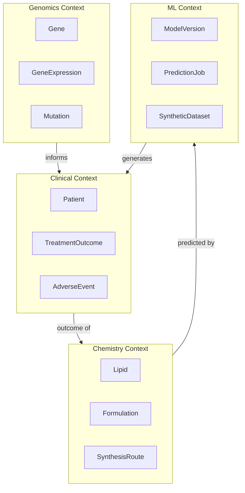

# مدل دامنه — Barekat Gen Therapy

این سند موجودیت‌ها، روابط و قوانین کسب‌وکار دامنه ژن‌درمانی را تعریف می‌کند.

---

## ۱. Bounded Contexts



---

## ۲. Chemistry Context

### Lipid (لیپید)

| فیلد | نوع | قوانین |
|------|-----|--------|
| `id` | UUID | PK, auto-generated |
| `name` | string | اختیاری |
| `smiles` | string | باید SMILES معتبر باشد |
| `inchi` | string | محاسبه‌شده از SMILES |
| `molecular_weight` | float | ۲۰۰–۲۰۰۰ Da |
| `logP` | float | -۲ تا ۱۵ |
| `lipid_class` | enum | `ionizable`, `helper`, `sterol`, `peg` |
| `structure_3d` | binary | فرمت SDF |
| `is_synthetic` | boolean | آیا توسط AI تولید شده |
| `source_job_id` | UUID | FK → PredictionJob (nullable) |

**قوانین کسب‌وکار:**
- SMILES باید توسط RDKit قابل parse باشد
- لیپیدهای تولیدشده توسط AI باید `is_synthetic=true` داشته باشند
- هر لیپید باید حداقل یک بار در یک Formulation استفاده شود یا صریحاً archive شود

### Formulation (فرمولاسیون)

| فیلد | نوع | قوانین |
|------|-----|--------|
| `id` | UUID | PK |
| `name` | string | — |
| `cargo_type` | enum | `mRNA`, `siRNA`, `DNA`, `CRISPR` |
| `cargo_sequence` | text | توالی nucleotide |
| `np_ratio` | float | ۱–۱۲ |
| `target_tissue` | enum | `spleen`, `liver`, `lung`, `tumor`, `custom` |
| `ph` | float | ۴.۰–۸.۰ |
| `lipid_ratios` | LipidRatio[] | مجموع molar_ratio = ۱.۰ |

### LipidRatio

| فیلد | نوع | قوانین |
|------|-----|--------|
| `lipid_id` | UUID | FK → Lipid |
| `molar_ratio` | float | ۰–۱, مجموع = ۱.۰ |
| `role` | enum | `ionizable`, `helper`, `sterol`, `peg` |

**قوانین کسب‌وکار:**
- هر Formulation باید دقیقاً یک لیپید ionizable داشته باشد
- نسبت PEG نباید از ۵٪ بیشتر باشد
- N/P ratio برای mRNA باید بین ۲–۸ باشد

---

## ۳. Clinical Context

### Patient (بیمار — ناشناس)

| فیلد | نوع | قوانین |
|------|-----|--------|
| `id` | string | فرمت `GT_XXXX` |
| `age` | int | ۱۰–۸۰ |
| `gender` | enum | `male`, `female`, `other` |
| `disease_severity` | float | ۱.۰–۱۰.۰ |
| `disease_type` | string | — |
| `immune_status` | enum | `normal`, `compromised`, `autoimmune` |
| `is_synthetic` | boolean | داده سنتتیک یا واقعی |

**قوانین حریم خصوصی:**
- هیچ PII (نام، کد ملی، آدرس) ذخیره نمی‌شود
- داده‌های واقعی باید ناشناس‌سازی شوند
- داده‌های سنتتیک باید `is_synthetic=true` داشته باشند

### TreatmentOutcome (پیامد درمان)

| فیلد | نوع | قوانین |
|------|-----|--------|
| `patient_id` | string | FK → Patient |
| `formulation_id` | UUID | FK → Formulation (nullable) |
| `time_to_recovery_days` | float | > ۰ |
| `event_status` | boolean | ۱ = رویداد رخ داده |
| `treatment_response` | boolean | ۱ = پاسخ مثبت |
| `toxicity_level` | float | ۰–۴ |
| `cytokine_storm` | boolean | — |

**تعریف رویداد (Event):**
- بهبودی کامل
- کاهش بار تومور ≥ ۳۰٪
- عود بیماری

### AdverseEvent (عوارض جانبی)

| فیلد | نوع | قوانین |
|------|-----|--------|
| `patient_id` | string | FK |
| `event_type` | enum | `cytokine_storm`, `hepatotoxicity`, `nephrotoxicity`, `other` |
| `severity` | enum | `mild`, `moderate`, `severe`, `life_threatening` |
| `onset_day` | int | روز از شروع درمان |

---

## ۴. Genomics Context

### Gene

| فیلد | نوع |
|------|-----|
| `id` | string (e.g. `Gene_5`) |
| `symbol` | string |
| `is_target` | boolean |
| `therapeutic_potential` | enum: `high`, `medium`, `low` |

### GeneExpression

| فیلد | نوع | قوانین |
|------|-----|--------|
| `patient_id` | string | FK |
| `gene_id` | string | FK |
| `expression_level` | float | log2 scale, ۰–۱۵ |

### Mutation

| فیلد | نوع | قوانین |
|------|-----|--------|
| `patient_id` | string | FK |
| `gene_id` | string | FK |
| `is_mutated` | boolean | — |
| `variant_type` | enum | `missense`, `nonsense`, `frameshift`, `unknown` |

---

## ۵. ML Context

### ModelVersion

| فیلد | نوع |
|------|-----|
| `id` | UUID |
| `name` | string |
| `version` | semver |
| `type` | enum: `generative`, `survival`, `toxicity`, `embedding`, `synthetic` |
| `status` | enum: `training`, `staging`, `production`, `archived` |
| `metrics` | JSON |
| `hyperparameters` | JSON |
| `artifact_uri` | string |
| `trained_at` | timestamp |

### PredictionJob

| فیلد | نوع |
|------|-----|
| `id` | UUID |
| `type` | enum: `design`, `predict`, `synthetic`, `rank` |
| `model_version_id` | UUID |
| `input` | JSON |
| `output` | JSON |
| `status` | enum: `queued`, `running`, `completed`, `failed` |
| `error_message` | string |
| `duration_ms` | int |
| `created_by` | UUID |

### SyntheticDataset

| فیلد | نوع |
|------|-----|
| `id` | UUID |
| `name` | string |
| `source_model_id` | UUID |
| `n_samples` | int |
| `validation_report` | JSON |
| `storage_uri` | string |
| `format` | enum: `csv`, `parquet`, `json` |

---

## ۶. Value Objects

### HazardRatio

```python
@dataclass(frozen=True)
class HazardRatio:
    variable: str
    coefficient: float
    confidence_interval: tuple[float, float]
    p_value: float
```

### MolecularDescriptor

```python
@dataclass(frozen=True)
class MolecularDescriptor:
    molecular_weight: float
    logP: float
    tpsa: float          # Topological Polar Surface Area
    hbd: int             # Hydrogen Bond Donors
    hba: int             # Hydrogen Bond Acceptors
    rotatable_bonds: int
```

### RankingScore

```python
@dataclass(frozen=True)
class RankingScore:
    efficacy: float       # ۰–۱
    safety: float         # ۰–۱
    synthesizability: float  # ۰–۱
    cost: float           # ۰–۱ (معکوس هزینه)
    final: float          # weighted sum
```

---

## ۷. Domain Events

| Event | Trigger | Payload |
|-------|---------|---------|
| `LipidDesigned` | مدل مولد لیپید جدید تولید کرد | lipid_id, job_id |
| `FormulationCreated` | فرمولاسیون جدید ثبت شد | formulation_id |
| `PredictionCompleted` | job پیش‌بینی تمام شد | job_id, metrics |
| `SyntheticDataGenerated` | dataset سنتتیک تولید شد | dataset_id, n_samples |
| `AdverseEventDetected` | عارضه جانبی شناسایی شد | patient_id, event_type |
| `ModelDeployed` | مدل به production رفت | model_version_id |

---

## ۸. نگاشت به پروتوتایپ فعلی

جدول زیر نشان می‌دهد فیلدهای موجود در اسکریپت `data` چگونه به مدل دامنه نگاشت می‌شوند:

| فیلد در `data` | موجودیت دامنه | توضیح |
|----------------|---------------|-------|
| `Patient_ID` | Patient.id | — |
| `Age` | Patient.age | — |
| `Gender` | Patient.gender | — |
| `Disease_Severity` | Patient.disease_severity | — |
| `Gene_N_Expr` | GeneExpression | N = 1..25 |
| `Gene_N_Mutation` | Mutation | N ∈ {5, 12, 18} |
| `Time_to_Recovery_days` | TreatmentOutcome.time_to_recovery_days | — |
| `Event_Status` | TreatmentOutcome.event_status | — |
| `Treatment_Response` | TreatmentOutcome.treatment_response | — |
| `Toxicity_Level` | TreatmentOutcome.toxicity_level | — |
| `Cytokine_Storm` | AdverseEvent | event_type=cytokine_storm |

---

*آخرین به‌روزرسانی: ۱۴۰۵/۰۴/۲۲*
