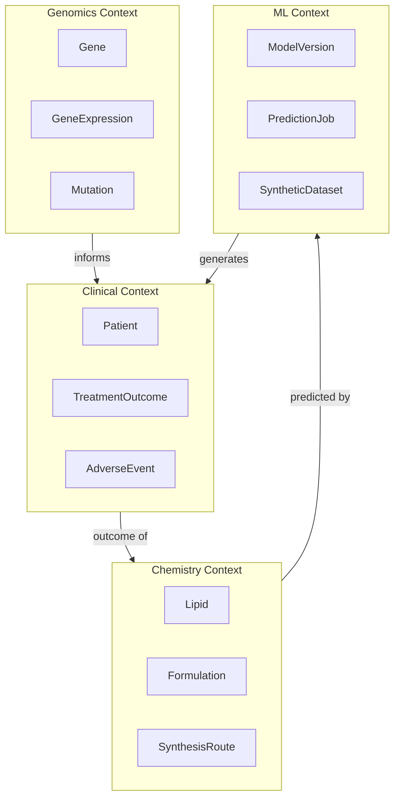

# Domain Model — Barekat Gen Therapy

This document defines the entities, relationships and business rules of the gene therapy domain.

---

## 1. Bounded Contexts


```mermaid
graph TB
    subgraph Chemistry["Chemistry Context"]
        Lipid
        Formulation
        SynthesisRoute
    end

    subgraph Clinical["Clinical Context"]
        Patient
        TreatmentOutcome
        AdverseEvent
    end

    subgraph Genomics["Genomics Context"]
        Gene
        GeneExpression
        Mutation
    end

    subgraph ML["ML Context"]
        ModelVersion
        PredictionJob
        SyntheticDataset
    end

    Chemistry -->|predicted by| ML
    Clinical -->|outcome of| Chemistry
    Genomics -->|informs| Clinical
    ML -->|generates| Clinical
```

---

## 2. Chemistry Context

### Lipid

| Field | Type | Rules |
|------|-----|--------|
| `id` | UUID | PK, auto-generated |
| `name` | string | optional |
| `smiles` | string | must be a valid SMILES |
| `inchi` | string | computed from SMILES |
| `molecular_weight` | float | 200–2000 Da |
| `logP` | float | -2 to 15 |
| `lipid_class` | enum | `ionizable`, `helper`, `sterol`, `peg` |
| `structure_3d` | binary | SDF format |
| `is_synthetic` | boolean | whether generated by AI |
| `source_job_id` | UUID | FK → PredictionJob (nullable) |

**Business rules:**
- SMILES must be parseable by RDKit
- AI-generated lipids must have `is_synthetic=true`
- Every lipid must be used in at least one Formulation or explicitly archived

### Formulation

| Field | Type | Rules |
|------|-----|--------|
| `id` | UUID | PK |
| `name` | string | — |
| `cargo_type` | enum | `mRNA`, `siRNA`, `DNA`, `CRISPR` |
| `cargo_sequence` | text | nucleotide sequence |
| `np_ratio` | float | 1–12 |
| `target_tissue` | enum | `spleen`, `liver`, `lung`, `tumor`, `custom` |
| `ph` | float | 4.0–8.0 |
| `lipid_ratios` | LipidRatio[] | sum of molar_ratio = 1.0 |

### LipidRatio

| Field | Type | Rules |
|------|-----|--------|
| `lipid_id` | UUID | FK → Lipid |
| `molar_ratio` | float | 0–1, sum = 1.0 |
| `role` | enum | `ionizable`, `helper`, `sterol`, `peg` |

**Business rules:**
- Every Formulation must have exactly one ionizable lipid
- The PEG ratio must not exceed 5%
- The N/P ratio for mRNA must be between 2–8

---

## 3. Clinical Context

### Patient (anonymous)

| Field | Type | Rules |
|------|-----|--------|
| `id` | string | format `GT_XXXX` |
| `age` | int | 10–80 |
| `gender` | enum | `male`, `female`, `other` |
| `disease_severity` | float | 1.0–10.0 |
| `disease_type` | string | — |
| `immune_status` | enum | `normal`, `compromised`, `autoimmune` |
| `is_synthetic` | boolean | synthetic or real data |

**Privacy rules:**
- No PII (name, national ID, address) is stored
- Real data must be anonymized
- Synthetic data must have `is_synthetic=true`

### TreatmentOutcome

| Field | Type | Rules |
|------|-----|--------|
| `patient_id` | string | FK → Patient |
| `formulation_id` | UUID | FK → Formulation (nullable) |
| `time_to_recovery_days` | float | > 0 |
| `event_status` | boolean | 1 = event occurred |
| `treatment_response` | boolean | 1 = positive response |
| `toxicity_level` | float | 0–4 |
| `cytokine_storm` | boolean | — |

**Event definition:**
- Complete recovery
- Tumor burden reduction ≥ 30%
- Disease relapse

### AdverseEvent

| Field | Type | Rules |
|------|-----|--------|
| `patient_id` | string | FK |
| `event_type` | enum | `cytokine_storm`, `hepatotoxicity`, `nephrotoxicity`, `other` |
| `severity` | enum | `mild`, `moderate`, `severe`, `life_threatening` |
| `onset_day` | int | day since treatment start |

---

## 4. Genomics Context

### Gene

| Field | Type |
|------|-----|
| `id` | string (e.g. `Gene_5`) |
| `symbol` | string |
| `is_target` | boolean |
| `therapeutic_potential` | enum: `high`, `medium`, `low` |

### GeneExpression

| Field | Type | Rules |
|------|-----|--------|
| `patient_id` | string | FK |
| `gene_id` | string | FK |
| `expression_level` | float | log2 scale, 0–15 |

### Mutation

| Field | Type | Rules |
|------|-----|--------|
| `patient_id` | string | FK |
| `gene_id` | string | FK |
| `is_mutated` | boolean | — |
| `variant_type` | enum | `missense`, `nonsense`, `frameshift`, `unknown` |

---

## 5. ML Context

### ModelVersion

| Field | Type |
|------|-----|
| `id` | UUID |
| `name` | string |
| `version` | semver |
| `type` | enum: `generative`, `survival`, `toxicity`, `embedding`, `synthetic` |
| `status` | enum: `training`, `staging`, `production`, `archived` |
| `metrics` | JSON |
| `hyperparameters` | JSON |
| `artifact_uri` | string |
| `trained_at` | timestamp |

### PredictionJob

| Field | Type |
|------|-----|
| `id` | UUID |
| `type` | enum: `design`, `predict`, `synthetic`, `rank` |
| `model_version_id` | UUID |
| `input` | JSON |
| `output` | JSON |
| `status` | enum: `queued`, `running`, `completed`, `failed` |
| `error_message` | string |
| `duration_ms` | int |
| `created_by` | UUID |

### SyntheticDataset

| Field | Type |
|------|-----|
| `id` | UUID |
| `name` | string |
| `source_model_id` | UUID |
| `n_samples` | int |
| `validation_report` | JSON |
| `storage_uri` | string |
| `format` | enum: `csv`, `parquet`, `json` |

---

## 6. Value Objects

### HazardRatio

```python
@dataclass(frozen=True)
class HazardRatio:
    variable: str
    coefficient: float
    confidence_interval: tuple[float, float]
    p_value: float
```

### MolecularDescriptor

```python
@dataclass(frozen=True)
class MolecularDescriptor:
    molecular_weight: float
    logP: float
    tpsa: float          # Topological Polar Surface Area
    hbd: int             # Hydrogen Bond Donors
    hba: int             # Hydrogen Bond Acceptors
    rotatable_bonds: int
```

### RankingScore

```python
@dataclass(frozen=True)
class RankingScore:
    efficacy: float       # 0–1
    safety: float         # 0–1
    synthesizability: float  # 0–1
    cost: float           # 0–1 (inverse of cost)
    final: float          # weighted sum
```

---

## 7. Domain Events

| Event | Trigger | Payload |
|-------|---------|---------|
| `LipidDesigned` | The generative model produced a new lipid | lipid_id, job_id |
| `FormulationCreated` | A new formulation was recorded | formulation_id |
| `PredictionCompleted` | The prediction job finished | job_id, metrics |
| `SyntheticDataGenerated` | A synthetic dataset was generated | dataset_id, n_samples |
| `AdverseEventDetected` | An adverse event was detected | patient_id, event_type |
| `ModelDeployed` | The model went to production | model_version_id |

---

## 8. Mapping to the Current Prototype

The table below shows how fields in the `data` script map to the domain model:

| Field in `data` | Domain entity | Description |
|----------------|---------------|-------|
| `Patient_ID` | Patient.id | — |
| `Age` | Patient.age | — |
| `Gender` | Patient.gender | — |
| `Disease_Severity` | Patient.disease_severity | — |
| `Gene_N_Expr` | GeneExpression | N = 1..25 |
| `Gene_N_Mutation` | Mutation | N ∈ {5, 12, 18} |
| `Time_to_Recovery_days` | TreatmentOutcome.time_to_recovery_days | — |
| `Event_Status` | TreatmentOutcome.event_status | — |
| `Treatment_Response` | TreatmentOutcome.treatment_response | — |
| `Toxicity_Level` | TreatmentOutcome.toxicity_level | — |
| `Cytokine_Storm` | AdverseEvent | event_type=cytokine_storm |

---

*Last updated: 1405/04/22*
